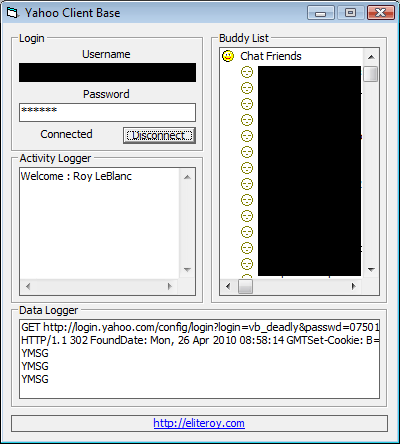



## Yahoo Client Base 1\.0

### Description

This Is A Example Which Can Be Used As A Base For A Yahoo Chat Client. Current Features Include Parse Buddy List(does not tell online status), Receive PM&#8217;s, Alerts Of User Typing, Alerts When User Goes Offline or Comes Online, Alerts For Buddy Status Change. Uses Encryption Less Login.

----

New Update - http://www.planet-source-code.com/vb/scripts/ShowCode.asp?txtCodeId=73120&amp;lngWId=1 

----

 
### More Info
 
Requires Winsock, Richtext, And Other Controls That Are Included In The Visual Studio 6 Install(in box)

Might Temporarily Lock Yahoo Accounts If You Login And Out Too Much.

             |
---                |---
**Submitted On**   |2010-04-26 05:01:22
**By**             |[Roy LeBlanc](https://github.com/Planet-Source-Code/PSCIndex/blob/master/ByAuthor/roy-leblanc.md)
**Level**          |Intermediate
**User Rating**    |5.0 (10 globes from 2 users)
**Compatibility**  |VB 5\.0, VB 6\.0
**Category**       |[Internet/ HTML](https://github.com/Planet-Source-Code/PSCIndex/blob/master/ByCategory/internet-html__1-34.md)
**World**          |[Visual Basic](https://github.com/Planet-Source-Code/PSCIndex/blob/master/ByWorld/visual-basic.md)
**Archive File**   |[Yahoo\_Clie2179704262010\.zip](https://github.com/Planet-Source-Code/roy-leblanc-yahoo-client-base-1-0__1-73096/archive/master.zip)

